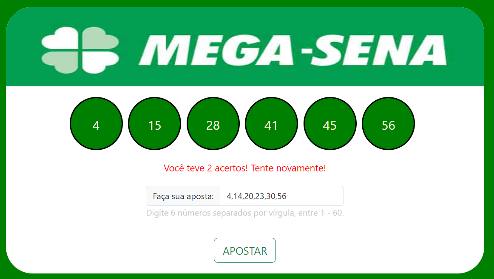

# MegaSena

Bem-vindo ao repositório MegaSena!

Este é um projeto simples onde você pode fazer apostas para o sorteio da Mega Sena diretamente em um navegador da web. O código JavaScript gera automaticamente números aleatórios para o sorteio e verifica se você acertou algum prêmio. Além disso, HTML e CSS são utilizados para criar uma interface amigável para o usuário.

## Como usar

1. Clone este repositório para o seu ambiente local:

```
git clone https://github.com/brunabenne/MegaSena.git
```

2. Abra o arquivo `index.html` em qualquer navegador da web.

3. Na página, você verá um formulário onde pode fazer suas apostas. Escolha 6 números diferentes entre 1 e 60.

4. Depois de fazer suas apostas, clique no botão "Apostar".

5. O código JavaScript irá gerar automaticamente os números do sorteio.

6. Em seguida, o programa verificará se você acertou algum prêmio e exibirá os resultados na página.



## Contribuições

Contribuições são bem-vindas! Se você tem alguma sugestão de melhoria ou encontrou algum problema, sinta-se à vontade para abrir uma issue ou enviar um pull request.

## Aviso Legal

Este projeto é apenas para fins educacionais e de entretenimento. Não há garantia de ganhos na loteria com base neste código. Por favor, jogue de forma responsável.
